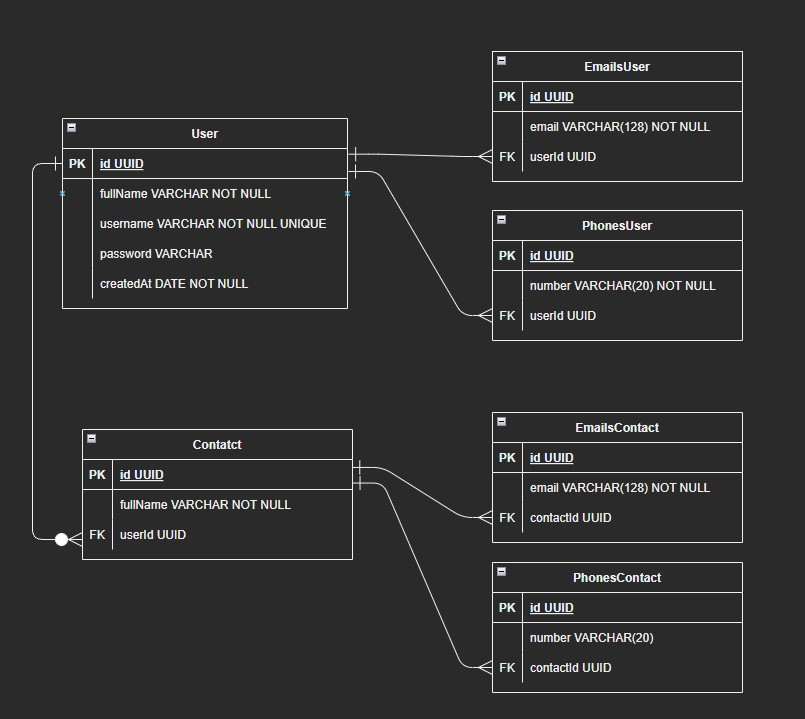

# Aplicação Backend - Contact

## 1. Visão Geral

Visão geral do projeto, um pouco das tecnologias usadas.

- [NodeJS](https://nodejs.org/en/)
- [Express](https://expressjs.com/pt-br/)
- [TypeScript](https://www.typescriptlang.org/)
- [PostgreSQL](https://www.postgresql.org/)
- [TypeORM](https://typeorm.io/)
- [Yup](https://www.npmjs.com/package/yup)

---

## 2. Diagrama ER

[ Ir para o sumário](#tabela-de-conteúdos)

Diagrama ER da API definindo bem as relações entre as tabelas do banco de dados.



---

## 3. Passo a passo para instalação:

### 3.1. Instalando Dependências

Após clonar o repositório, acesse a pasta do projeto Backend, e então execute o comando abaixo:

```bash
yarn
```

### 3.2. Variáveis de Ambiente

Após instalar as dependencias, você deverá criar um arquivo .env e configurá-lo com suas informações:

- Se preferir, você também pode copiar o arquivo .env.example e aterá-lo para .env

```
cp .env.example .env
```

```bash
DB_HOST=
DB_USER=
DB_PASSWORD=
DB=
SECRET_KEY=
```

Configure suas variáveis de ambiente com suas credenciais do Postgres e uma nova database da sua escolha.

### 3.3. Migrations

[ Ir para o sumário](#tabela-de-conteúdos)

Execute as migrations com o comando:

```
yarn typeorm migration:run -d src/data-source.ts
```

### 3.4. Rodando a aplicação

Após isso basta executar o comando abaixo para rodar a aplicação:

```bash
yarn dev
```

Prontinho, agora você pode seguir para pasta do Frontend.

---

## 4. Endpoints

[ Ir para o sumário](#tabela-de-conteúdos)

---

## Endpoints Resumo

### 1. /users

O objeto User é definido como:

| Campo      | Tipo     | Descrição                       |
| ---------- | -------- | ------------------------------- |
| id         | uuid     | Identificador único do usuário. |
| fullName   | string   | Nome completo do usuário.       |
| username   | string   | Nome de usuário.                |
| password   | string   | Senha do usuário.               |
| createdAt  | Date     | Data de registro do usuário.    |
| emailsUser | string[] | Emails do usuário.              |
| phonesUser | string[] | Telefones do usuário.           |

### Endpoints

| Método | Rota            | Descrição                                      | Autorizaçao |
| ------ | --------------- | ---------------------------------------------- | ----------- |
| POST   | /users          | Criação de um usuário.                         |             |
| GET    | /users          | Lista todos os usuários.                       | X           |
| GET    | /users/contacts | Lista todos contatos de um usuário logado.     | X           |
| GET    | /users/:id      | Lista um usuário usando seu ID como parâmetro. | X           |
| DELETE | /users/:id      | Deleta os usuários.                            | X           |

### 1.1. **Criação do Usuário**

### `/users`

### Exemplo de Request:

```
POST /users
Content-type: application/json
```

### Corpo da Requisição:

```json
{
  "fullName": "Gabrielle da Silva Santos",
  "username": "gabi",
  "password": "1234a",
  "emailsUser": ["gabi@outlook.com", "eugabi@gmail.com"],
  "phonesUser": ["15-99103-3454", "1-234-5356"]
}
```

### Exemplo de Response:

```
201 Created
```

```json
{
  "fullName": "Gabrielle da Silva Santos",
  "username": "gabi",
  "id": "6214010e-a923-411a-aed1-feebeea6f298",
  "createdAt": "2022-12-05T18:07:58.610Z"
}
```

### Possíveis Erros:

| Código do Erro  | Descrição                                                    |
| --------------- | ------------------------------------------------------------ |
| 400 Bad Request | You can't add more than 3 phone numbers or emails to a User. |
| 409 Conflict    | Username already exist.                                      |

---

### 1.2. **Listando Usuários**

### `/users`

### Exemplo de Request:

```
GET /users
Authorization: Bearer token
Content-type: application/json
```

### Corpo da Requisição:

```json
Vazio
```

### Exemplo de Response:

```
200 OK
```

```json
[
  {
    "id": "ef900843-7be3-4f8c-a333-8d39ddf6e844",
    "fullName": "Matheus da Silva Santos",
    "username": "matheus",
    "createdAt": "2022-12-03T23:31:58.671Z",
    "emailsUser": [
      {
        "id": "fe3ebf3a-cf5c-4f49-803f-c13826d97d98",
        "email": "eumtssantos@outlook.com"
      },
      {
        "id": "2054b0b9-8fc0-4c21-9646-17d3c50bd39f",
        "email": "matheus.knight28@gmail.com"
      }
    ],
    "phonesUser": [
      {
        "id": "c7c56751-5500-485c-8691-9abbbb6b7b3a",
        "number": "15-99110-3040"
      },
      {
        "id": "0956ebda-3fc1-45f6-9739-4ffddf6c7f06",
        "number": "12-99103-4002"
      }
    ]
  }
]
```

### Possíveis Erros:

Nenhum, o máximo que pode acontecer é retornar uma lista vazia.

---

### 1.3. **Listar Contatos do Usuário logado**

### `/users/contacts`

### Exemplo de Request:

```
GET /users/contacts
Authorization: Bearer token
Content-type: application/json
```

### Corpo da Requisição:

```json
Vazio
```

### Exemplo de Response:

```
200 OK
```

```json
{
  "id": "a018ef9b-f69c-4669-8aa6-996a6df88c51",
  "fullName": "Gabrielle da Silva Santos",
  "username": "gabi",
  "password": "$2a$10$uSPj2WU1GMv2fL4fcPbC9emDJDnsJvlbUti2zVwJkMmo5Znw4c5We",
  "createdAt": "2022-12-05T23:12:06.663Z",
  "contacts": [
    {
      "id": "d6c0ab80-80cd-453e-a457-aafb15f5f5c3",
      "fullName": "Rafael Santos",
      "emailsContact": [
        {
          "id": "a7841bb2-661e-424c-8ff9-14f1c1f6fda0",
          "email": "rafael_pombo@mail.com"
        },
        {
          "id": "0a4de0ce-0301-4543-9dbb-34e5cff99b0d",
          "email": " pombo@gmail.com"
        }
      ],
      "phonesContact": [
        {
          "id": "df1d6c62-52ce-4c28-9af8-a3607e7976c4",
          "number": " 12-99723-4050"
        },
        {
          "id": "f9b1e3d3-ba7e-4abd-91b1-e377819d8ca0",
          "number": "15-99130-1020"
        }
      ],
      "user": {
        "id": "a018ef9b-f69c-4669-8aa6-996a6df88c51",
        "fullName": "Gabrielle da Silva Santos",
        "username": "gabi",
        "password": "$2a$10$uSPj2WU1GMv2fL4fcPbC9emDJDnsJvlbUti2zVwJkMmo5Znw4c5We",
        "createdAt": "2022-12-05T23:12:06.663Z"
      }
    }
  ],
  "emailsUser": [
    {
      "id": "bb0d6335-8ecc-4da2-9d23-95c4964f9314",
      "email": "gabi@mail.com"
    },
    {
      "id": "f430d4b3-09ba-4cef-9a5a-39ca305bef6a",
      "email": " eugabi@gmail.com"
    }
  ],
  "phonesUser": [
    {
      "id": "d723a660-5929-427b-a7eb-d58d99e2cb16",
      "number": "15-99120-1020"
    },
    {
      "id": "62c759be-d7d9-467d-a6c9-0676f97249a5",
      "number": " 1-234-5546"
    }
  ]
}
```

### Possíveis Erros:

| Código do Erro | Descrição       |
| -------------- | --------------- |
| 404 Not Found  | User not found. |

---

---

### 1.4. **Listar usuário por ID**

### `/users/:userId`

### Exemplo de Request:

```
GET /users/:userId
Authorization: Bearer token
Content-type: application/json
```

### Parâmetros da Requisição:

| Parâmetro | Tipo | Descrição                       |
| --------- | ---- | ------------------------------- |
| userId    | uuid | Identificador único do usuário. |

### Corpo da Requisição:

```json
Vazio
```

### Exemplo de Response:

```
200 OK
```

```json
{
  "id": "ef900843-7be3-4f8c-a333-8d39ddf6e844",
  "fullName": "Matheus da Silva Santos",
  "username": "matheus",
  "password": "$2a$10$Dti4Bf0rjk4HFO7L.hxOaeMPHUsQkCSMaERPk7oydxVZahcvej0pu",
  "createdAt": "2022-12-03T23:31:58.671Z",
  "emailsUser": [
    {
      "id": "fe3ebf3a-cf5c-4f49-803f-c13826d97d98",
      "email": "eumtssantos@outlook.com"
    },
    {
      "id": "2054b0b9-8fc0-4c21-9646-17d3c50bd39f",
      "email": "matheus.knight28@gmail.com"
    }
  ],
  "phonesUser": [
    {
      "id": "0956ebda-3fc1-45f6-9739-4ffddf6c7f06",
      "number": "12-99103-4002"
    },
    {
      "id": "c7c56751-5500-485c-8691-9abbbb6b7b3a",
      "number": "15-99110-3040"
    }
  ]
}
```

---

### Possíveis Erros:

| Código do Erro | Descrição       |
| -------------- | --------------- |
| 404 Not Found  | User not found. |

---

### 1.5. **Deletar Usuário por ID**

### `/users/:userId`

### Exemplo de Request:

```
DELETE /users/:userId
Authorization: Bearer Token
Content-type: application/json
```

### Parâmetros da Requisição:

| Parâmetro | Tipo | Descrição                       |
| --------- | ---- | ------------------------------- |
| userId    | uuid | Identificador único do usuário. |

### Corpo da Requisição:

```json
Vazio
```

### Exemplo de Response:

```
204 No Content
```

```json
No body returned for response
```

### Possíveis Erros:

| Código do Erro   | Descrição                        |
| ---------------- | -------------------------------- |
| 404 Not Found    | User not found                   |
| 401 Unauthorized | You must be owner to delete this |

---

AAQQUUII

### 2. /contacts

O objeto Contact é definido como:

| Campo      | Tipo     | Descrição                       |
| ---------- | -------- | ------------------------------- |
| id         | uuid     | Identificador único do contato. |
| fullName   | string   | Nome completo do contato.       |
| emailsUser | string[] | Emails do contato.              |
| phonesUser | string[] | Telefones do contato.           |

### Endpoints

| Método | Rota          | Descrição                | Autorizaçao |
| ------ | ------------- | ------------------------ | ----------- |
| POST   | /contacts     | Criação de um usuário.   | X           |
| GET    | /contacts     | Lista todos os usuários. | X           |
| DELETE | /contacts/:id | Deleta os usuários.      | X           |

### 1.1. **Criação de Contato**

### `/contacts`

### Exemplo de Request:

```
POST /contacts
Authorization: Bearer token
Content-type: application/json
```

### Corpo da Requisição:

```json
{
  "fullName": "Rafael da Silva Santos",
  "emailsContact": ["rafael_verdao@hotmail.com", "eurflsantos@outlook.com"],
  "phonesContact": ["15-99123-3040", "12-99103-2045"]
}
```

### Exemplo de Response:

```
201 Created
```

```json
{
  "fullName": "Rafael da Silva Santos",
  "user": {
    "id": "ef900843-7be3-4f8c-a333-8d39ddf6e844",
    "fullName": "Matheus da Silva Santos",
    "username": "matheus",
    "password": "$2a$10$Dti4Bf0rjk4HFO7L.hxOaeMPHUsQkCSMaERPk7oydxVZahcvej0pu",
    "createdAt": "2022-12-03T23:31:58.671Z",
    "emailsUser": [
      {
        "id": "fe3ebf3a-cf5c-4f49-803f-c13826d97d98",
        "email": "eumtssantos@outlook.com"
      },
      {
        "id": "2054b0b9-8fc0-4c21-9646-17d3c50bd39f",
        "email": "matheus.knight28@gmail.com"
      }
    ],
    "phonesUser": [
      {
        "id": "0956ebda-3fc1-45f6-9739-4ffddf6c7f06",
        "number": "12-99103-4002"
      },
      {
        "id": "c7c56751-5500-485c-8691-9abbbb6b7b3a",
        "number": "15-99110-3040"
      }
    ]
  },
  "id": "618ab661-5f60-474a-bdd3-b04936dd52a7"
}
```

### Possíveis Erros:

| Código do Erro  | Descrição                                                       |
| --------------- | --------------------------------------------------------------- |
| 400 Bad Request | You can't add more than 3 phone numbers or emails to a Contact. |

---

### 1.2. **Listando Contatos**

### `/contacts`

### Exemplo de Request:

```
GET /users
Authorization: Bearer token
Content-type: application/json
```

### Corpo da Requisição:

```json
Vazio
```

### Exemplo de Response:

```
200 OK
```

```json
[
  {
    "id": "618ab661-5f60-474a-bdd3-b04936dd52a7",
    "fullName": "Rafael da Silva Santos",
    "emailsContact": [
      {
        "id": "6d9d5f89-7eab-40d7-8417-3d6c339c90ad",
        "email": "rafael_verdao@hotmail.com"
      },
      {
        "id": "457e6e07-baa1-47ba-940a-157d446105ed",
        "email": "eurflsantos@outlook.com"
      }
    ],
    "phonesContact": [
      {
        "id": "a9b2f2a8-4610-48a2-8ead-abd4a7e3fda4",
        "number": "12-99103-2045"
      },
      {
        "id": "a5b78a70-6ea3-45b4-85c1-5bd8148a1ad1",
        "number": "15-99123-3040"
      }
    ],
    "user": {
      "id": "ef900843-7be3-4f8c-a333-8d39ddf6e844",
      "fullName": "Matheus da Silva Santos",
      "username": "matheus",
      "password": "$2a$10$Dti4Bf0rjk4HFO7L.hxOaeMPHUsQkCSMaERPk7oydxVZahcvej0pu",
      "createdAt": "2022-12-03T23:31:58.671Z",
      "emailsUser": [
        {
          "id": "2054b0b9-8fc0-4c21-9646-17d3c50bd39f",
          "email": "matheus.knight28@gmail.com"
        },
        {
          "id": "fe3ebf3a-cf5c-4f49-803f-c13826d97d98",
          "email": "eumtssantos@outlook.com"
        }
      ],
      "phonesUser": [
        {
          "id": "c7c56751-5500-485c-8691-9abbbb6b7b3a",
          "number": "15-99110-3040"
        },
        {
          "id": "0956ebda-3fc1-45f6-9739-4ffddf6c7f06",
          "number": "12-99103-4002"
        }
      ]
    }
  }
]
```

### Possíveis Erros:

Nenhum, o máximo que pode acontecer é retornar uma lista vazia.

---

### 1.3. **Deletar Contato por ID**

### `/contacts/:contactId`

### Exemplo de Request:

```
DELETE /contacts/:contactId
Authorization: Bearer Token
Content-type: application/json
```

### Parâmetros da Requisição:

| Parâmetro | Tipo | Descrição                       |
| --------- | ---- | ------------------------------- |
| contactId | uuid | Identificador único do contato. |

### Corpo da Requisição:

```json
Vazio
```

### Exemplo de Response:

```
204 No Content
```

```json
No body returned for response
```

### Possíveis Erros:

| Código do Erro   | Descrição                                |
| ---------------- | ---------------------------------------- |
| 404 Not Found    | Contact not found                        |
| 401 Unauthorized | You must be contact owner to delete this |

---

# Documentação da API

## Tabela de Conteúdos

- [Aplicação Backend - Contact](#aplicação-backend---contact)
  - [1. Visão Geral](#1-visão-geral)
  - [2. Diagrama ER](#2-diagrama-er)
  - [3. Passo a passo para instalação:](#3-passo-a-passo-para-instalação)
    - [3.1. Instalando Dependências](#31-instalando-dependências)
    - [3.2. Variáveis de Ambiente](#32-variáveis-de-ambiente)
    - [3.3. Migrations](#33-migrations)
    - [3.4. Rodando a aplicação](#34-rodando-a-aplicação)
  - [4. Endpoints](#4-endpoints)
  - [Endpoints Resumo](#endpoints-resumo)
    - [1. /users](#1-users)
    - [Endpoints](#endpoints)
    - [1.1. **Criação do Usuário**](#11-criação-do-usuário)
    - [`/users`](#users)
    - [Exemplo de Request:](#exemplo-de-request)
    - [Corpo da Requisição:](#corpo-da-requisição)
    - [Exemplo de Response:](#exemplo-de-response)
    - [Possíveis Erros:](#possíveis-erros)
    - [1.2. **Listando Usuários**](#12-listando-usuários)
    - [`/users`](#users-1)
    - [Exemplo de Request:](#exemplo-de-request-1)
    - [Corpo da Requisição:](#corpo-da-requisição-1)
    - [Exemplo de Response:](#exemplo-de-response-1)
    - [Possíveis Erros:](#possíveis-erros-1)
    - [1.3. **Listar Contatos do Usuário logado**](#13-listar-contatos-do-usuário-logado)
    - [`/users/contacts`](#userscontacts)
    - [Exemplo de Request:](#exemplo-de-request-2)
    - [Corpo da Requisição:](#corpo-da-requisição-2)
    - [Exemplo de Response:](#exemplo-de-response-2)
    - [Possíveis Erros:](#possíveis-erros-2)
    - [1.4. **Listar usuário por ID**](#14-listar-usuário-por-id)
    - [`/users/:userId`](#usersuserid)
    - [Exemplo de Request:](#exemplo-de-request-3)
    - [Parâmetros da Requisição:](#parâmetros-da-requisição)
    - [Corpo da Requisição:](#corpo-da-requisição-3)
    - [Exemplo de Response:](#exemplo-de-response-3)
    - [Possíveis Erros:](#possíveis-erros-3)
    - [1.5. **Deletar Usuário por ID**](#15-deletar-usuário-por-id)
    - [`/users/:userId`](#usersuserid-1)
    - [Exemplo de Request:](#exemplo-de-request-4)
    - [Parâmetros da Requisição:](#parâmetros-da-requisição-1)
    - [Corpo da Requisição:](#corpo-da-requisição-4)
    - [Exemplo de Response:](#exemplo-de-response-4)
    - [Possíveis Erros:](#possíveis-erros-4)
    - [2. /contacts](#2-contacts)
    - [Endpoints](#endpoints-1)
    - [1.1. **Criação de Contato**](#11-criação-de-contato)
    - [`/contacts`](#contacts)
    - [Exemplo de Request:](#exemplo-de-request-5)
    - [Corpo da Requisição:](#corpo-da-requisição-5)
    - [Exemplo de Response:](#exemplo-de-response-5)
    - [Possíveis Erros:](#possíveis-erros-5)
    - [1.2. **Listando Contatos**](#12-listando-contatos)
    - [`/contacts`](#contacts-1)
    - [Exemplo de Request:](#exemplo-de-request-6)
    - [Corpo da Requisição:](#corpo-da-requisição-6)
    - [Exemplo de Response:](#exemplo-de-response-6)
    - [Possíveis Erros:](#possíveis-erros-6)
    - [1.3. **Deletar Contato por ID**](#13-deletar-contato-por-id)
    - [`/contacts/:contactId`](#contactscontactid)
    - [Exemplo de Request:](#exemplo-de-request-7)
    - [Parâmetros da Requisição:](#parâmetros-da-requisição-2)
    - [Corpo da Requisição:](#corpo-da-requisição-7)
    - [Exemplo de Response:](#exemplo-de-response-7)
    - [Possíveis Erros:](#possíveis-erros-7)
- [Documentação da API](#documentação-da-api)
  - [Tabela de Conteúdos](#tabela-de-conteúdos)

---
